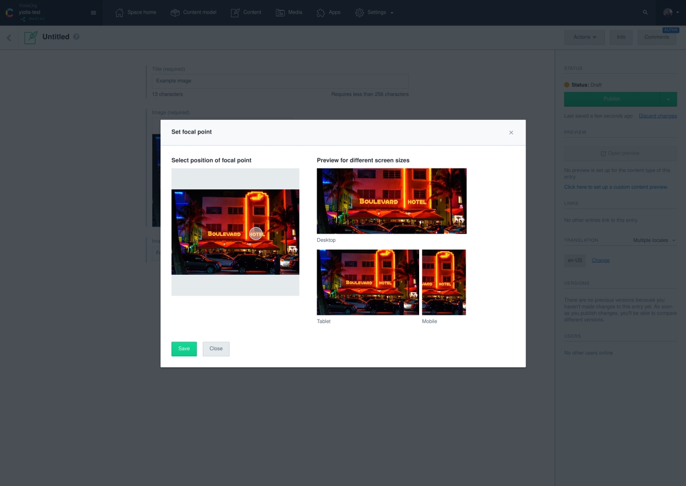
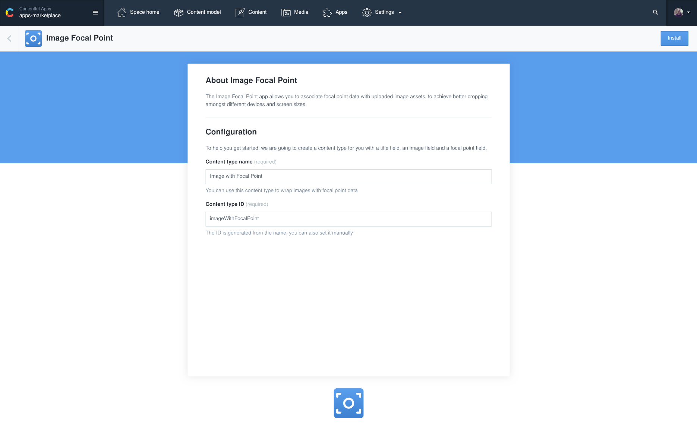
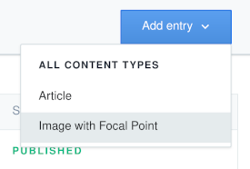
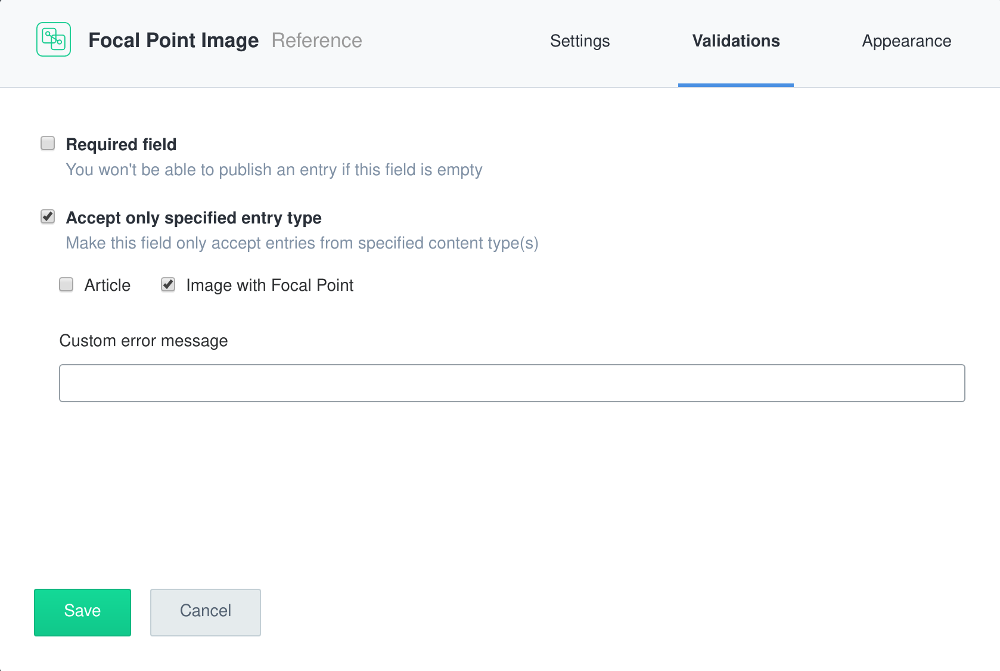
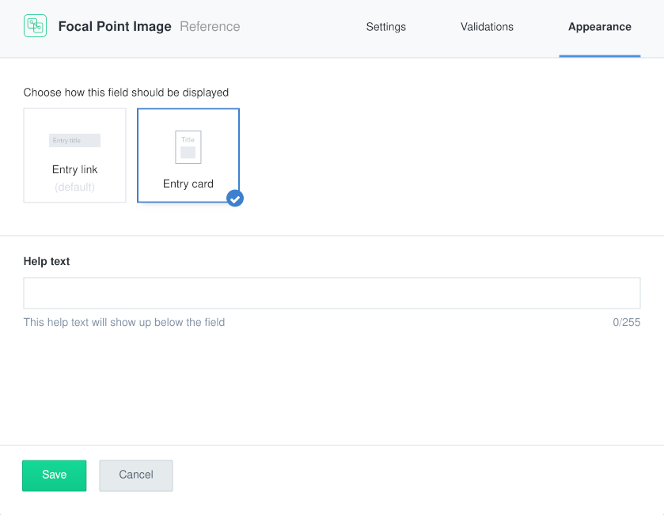
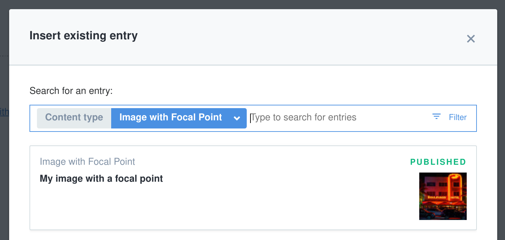

# Image Focal Point app

The Image Focal Point app allows you to associate images with focal point data for better cropping amongst different devices and screen sizes

## Usage

### Step 1: Install

Fill in the `Content type name` field (or use the default value `Image with Focal Point`) and click on `Install`.

This will create a new content type for you with three fields:

- A title field of type `Short Text`
- An image field of type `Media`
- A focal point field of type `JSON Object`

### Step 2: Create a new Image with Focal Point entry and set the focal point data

To create your first image with focal point data:

1. Navigate to the `Content` page
2. Create a new entry of type `Image with Focal Point` (or the name you chose during the
   installation)
   
3. Fill in the title, image and focal point data.
4. Click on `Publish` in the sidebar to publish the new image with focal point entry.

### Step 3: Configure your content type that needs a reference to the image with focal point

To make use of the newly created image with focal point entry:

1. Go to the `Content model` page
2. Edit the content type that needs to reference the image with focal point
3. Create a new field of type `Reference` and open its configuration.
4. Set a validation option to accept only entries of type `Image with Focal Point`

5. Optionally set the widget of the new reference field to `Entry Card` to have a preview of the image with focal point it links to

6. Go back to the `Content` page
7. Create/edit an entry of the content type referencing the image with focal point.
8. Set the reference field you added to point to the image with focal point entry.

