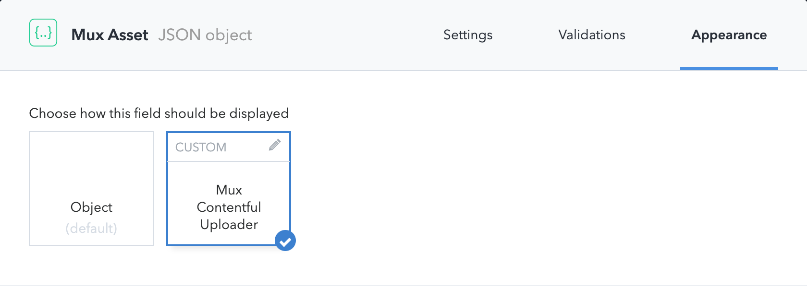

A Contentful UI extension that makes it simple to add beautiful streaming via [Mux](https://https://mux.com) to your [Contentful](https://contentful.com) project. Just install the extension, add the component to your content model, and you're good to go! 🙌🏾

## Setup

Before getting started, make sure to generate a new [Access Token](https://dashboard.mux.com/settings/access-tokens).

After installing this extension, a page with your new extension's configuration will open. Update the two required fields with your Mux Access Token ID/Secret, then hit "save".

## Setting up your content model

Create a new JSON field in the model you'd like to add Video to. Name the field something useful and descriptive like, for example "Mux Asset".

Click on the "Appearance" tab.

Select "Mux Contentful Uploader"



Congratulations, now you've got the upload side of your very own best-in-class video platform! 🤘🏻

## Using your new Video field in clients

The Mux Asset JSON object you'll get in your clients will look like this:

```
{
  "uploadId": "some-upload-id",
  "assetId": "some-asset-id",
  "playbackId": "a-public-playback-id"
  "ready": true,
  "ratio": "16:9",
}
```

Both `uploadId` and `assetId` are things we need to manage the asset in the Mux API. `playbackId` is what you'll use in your player. If you want help setting up a player, we have a set of [guides](https://docs.mux.com/docs/playback) to help you get started.

## Talk to us!

This extension was made with 💖 by the folks from [Mux](https://mux.com). If you have any questions or feedback, [let us know](mailto:help@mux.com)!
