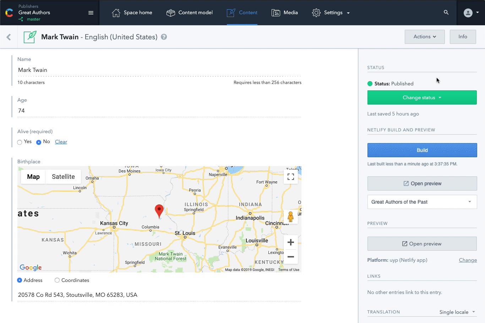
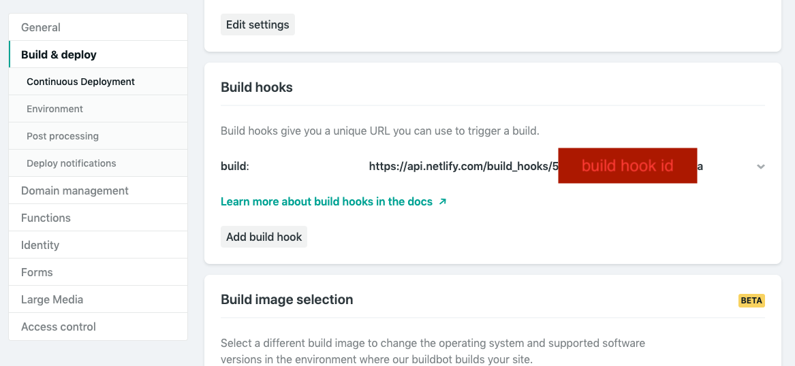
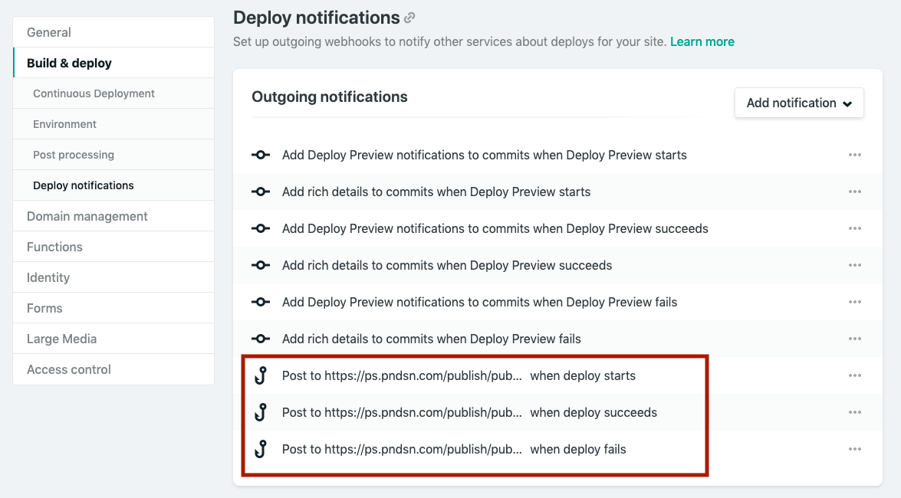
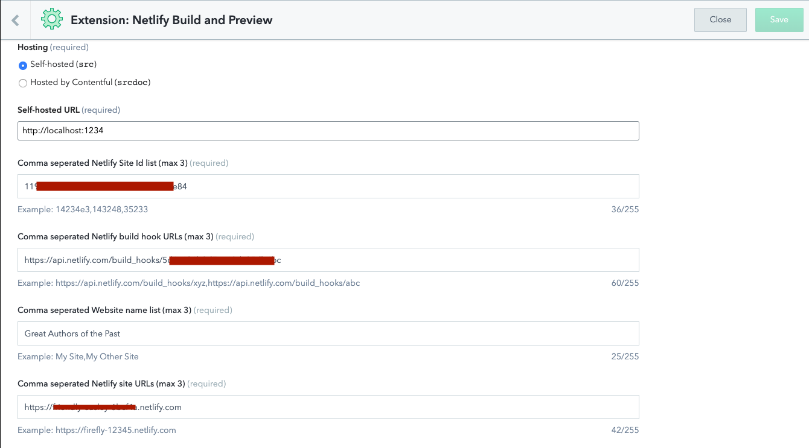
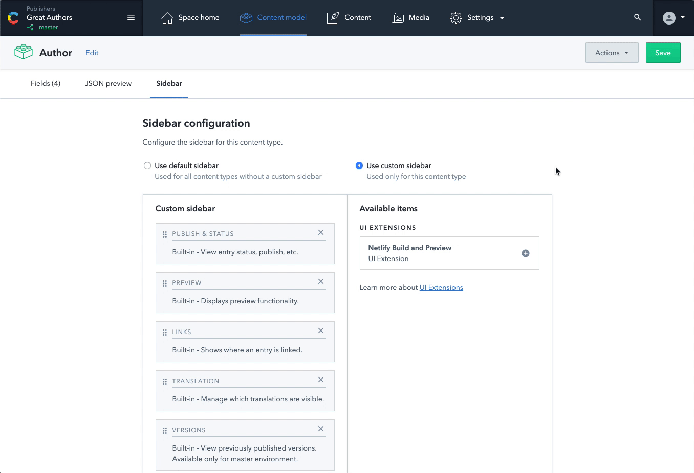

# Netlify Build and Preview

This sidebar extension allows you to build and preview up to 3 Netlify sites from within
the entry editor. The preview button will open your site in a new window.

This is an alternative approach to using a webhook to trigger a build. The advantage
is that the editor gets control on when a build is executed instead of responding
to automatic events such as `Entry.publish`.



## Requirements
+ A Netlify site that you own or are an admin of
+ Ability to install Contentful extensions

## Installation


### Step 1: Create Netlify build hook

On Netlify, go into your site settings. Add a build hook by navigating to "Build
and Deploy", then find the "Build hooks" category. Click the "Add build hook" to
get a `buildHookUrl`.



Fig 1.1

Once you have a build hook url, you will need to copy the `build hook id`, which
is the end of the build hook url as seen in Fig 1.1. Then scroll down to
"Deploy notifications".

### Step 2: Create Netlify outgoing webhooks

In order to ensure the extension can listen for build events, you will create 3 outgoing webhooks. 



Fig 1.2

Here you **must** add 3 outgoing webhooks for when the deploy starts, the deploy
succeeds, and the deploy fails. (As seen in the red box in Fig 1.2)

Click "Add notification" and use the following URL to populate the notify URL
field (seen in Fig 1.3) for each of the 3 webhook actions, deploy starts, deploy
succeeds, and deploy fails. You will need to do this one at a time.


```
https://ps.pndsn.com/publish/pub-c-a99421b9-4f21-467b-ac0c-d0292824e8e1/sub-c-3992b1ae-f7c9-11e8-adf7-5a5b31762c0f/0/{build hook id}/0?store=1
```
Replace `{build hook id}` with the ID you copied from Step 1, Fig 1.1.


Fig 1.3

### Step 3: Installing the Netlify Build and Preview extension

Install the extension from GitHub. For more information on installing extensions,
see the [example of installing an extension into your space](https://www.contentful.com/developers/docs/extensibility/ui-extensions/examples/#installing-an-example-into-your-space).


### Step 4: Configure the extension with your Netlify webhooks
Fill in the information provided from Netlify. 

**Important:** If you are providing multiple values, they should be in a comma 
seperated list and all values should be added to these lists in respective order.

+ Build hook urls were created in Step 1, Fig 1.1.
+ Site ID can be found in Site Details->Site Information as `API ID`.
+ The website name is a way to label the site on Contentful when it shows in the UI.
You can make this up yourself.



Fig 1.4

Click "Save" in the top right once all the configuration is filled in.

### Step 5: Add the extension to the sidebar

Navigate to the Content model page. You can enable the Netlify Build and Preview Sidebar extension
indivdually for any content type sidebar.



Fig 1.5

Now you're done!