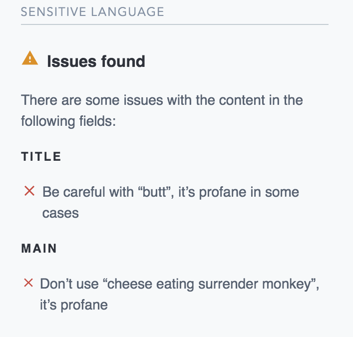

An extension to check for insensitive writing.

Checks all text fields for insensitive language using [Alex.js](https://alexjs.com/). Alex helps you find gender
favouring, polarising, race related, religion inconsiderate, or other unequal phrasing in text. The extension is
installed into the sidebar and will show violations for the following field types:

- short text
- long text (incl. markdown)
- rich text

You can configure the extension to ignore specific fields and rules.
