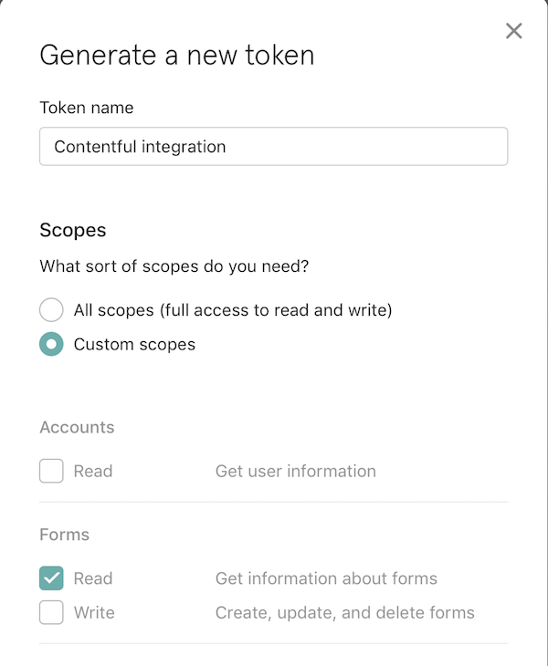

Integrate [Typeform](https://www.typeform.com) into the Contentful web app. It allows you to reference Typeforms to display or open them.

## Installation

Before installing this extension, create a [personal access token](https://developer.typeform.com/get-started/personal-access-token/)
with only the "Forms Read" scope. We suggest creating a dedicated user for this purpose, as every user of the Contentful
space configured with this extension can read all the typeforms this account has access to, no matter the workspace.

After installing the extension, you'll set this token as the "Typeform Access Token" for this extension. You can also
limit selection to a specific workspace, either for a space or for the use of one field. Note that this does not protect
the access token, it merely makes things easier for editors.

## Setup

After installing and configuring the extension, it'll be available as a new appearance on "short text" (`Symbol`) fields.

### Rendering forms

The value stored by the extension is the Typeform's URL. You can either use the value as a link to a form or use
Typeform's [Embed SDK](https://developer.typeform.com/embed/) to embed the form within a page.
