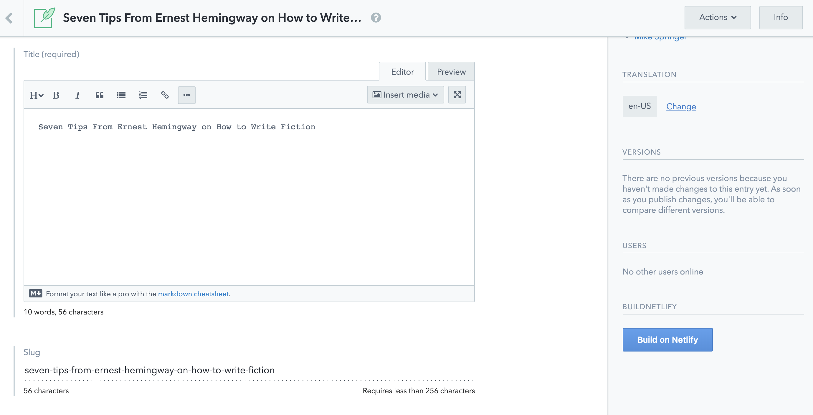
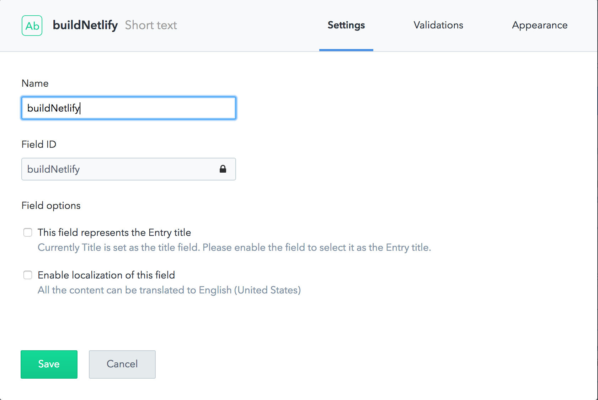
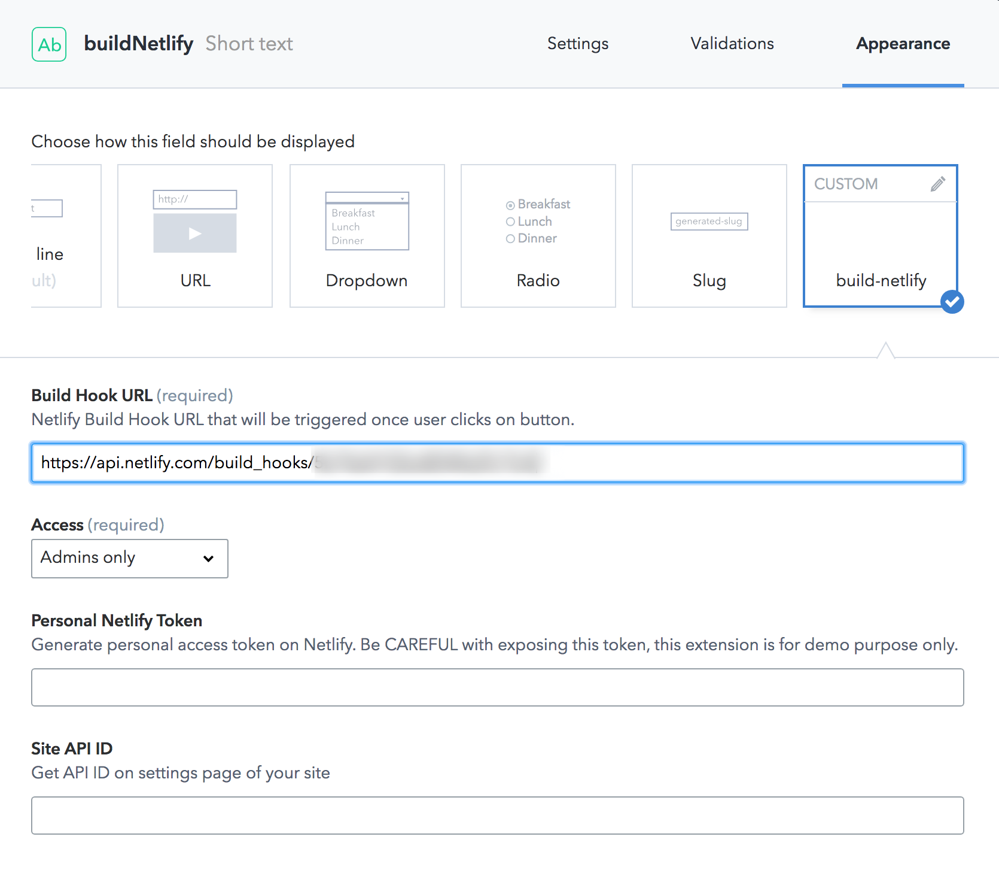

# Netlify - build manually

This Sidebar Extension shows how to use Netlify API so you could trigger Netlify builds manually while editing content.

This is an alternative approach to using a webhook to trigger a build. The advantage is that the editor gets control on when a build is executed instead of responding to automatic events such as `Entry.publish`.

## Requirements

1. Get Build URL on [Netlify](https://www.netlify.com/docs/webhooks/).
2. (optional) If you want to see the status of the build you triggered, you need to provide the following information:
   * Get a [personal access token](https://app.netlify.com/account/applications)
   * Get the API ID of your site in Site Details.
   * **IMPORTANT**: In a real world application the token should **be kept secret**. A good approach would be to wrap the token on a Netlify Function or host the entire UI Extensions 3rd party so the server can handle the secret API token properly.

## Setup

1. Setup sidebar extension.
2. Go to *Content model* and create new field.

3. Go to *Appearance* tab and provide all required information.

4. Save changes in *Content model*
5. Now while editing, the editor can click the new button in the sidebar to manually trigger a new build on Netlify.

## TODO

* Add example of using Neflify Function that keeps all secrets

