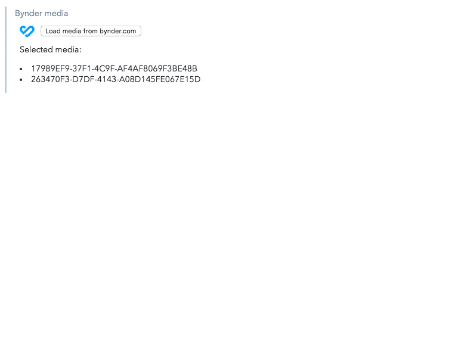

## Bynder media browser

This UI Extension integrates with [Bynder's](https://www.bynder.com) digital asset management platform. It leverages Bynder's [compact view](https://developer-docs.bynder.com/UI%20components/#compact-view) component to browse media in a project on Bynder.

The IDs of selected media is then stored in Contentful. Clients can then easily fetch content from Contentful and resolve all needed details on media by using the IDs to fetch binaries or meta data from Bynder's API.


The UI Extension in the Contentful web app

## How does the UI Extension work?

- it loads Bynder's compact view
- prompts the user for the URL

## Requirements

- the UI Extension has to be 3rd party hosted using the `src` property
- an account with Bynder with access to a brand portal (`yourIdentifier.getbynder.com`)

## TODOs

- the compact view is not showing previously selected media and will always reset the selection of a previous session

## Usage

For local development, start a webserver:

```bash
❯python -m SimpleHTTPServer
```

Remember to enable mixed-mode in your browser if you serve the extensions from `http` and not `https`.

To install the UI Extension:

```bash
contentful extension create
```

To update the UI Extension:

```bash
contentful extension update --force
```
