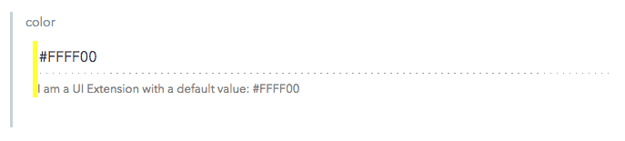
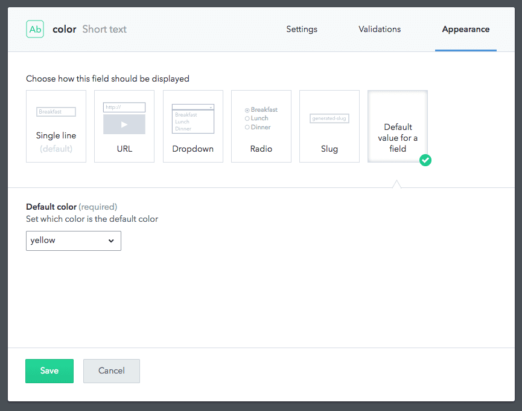

## Default field values

This UI Extension renders a `single line` input element which populates a default field value. It behaves like the default `single line` appearance but the user can choose a default field value from a list that is configurable.


The UI Extension in the Contentful web app

In this example the provided options for a `color` field are:

```json
"options": [
  {"#0000FF": "blue"},
  {"#FFFF00": "yellow"},
  {"#FF0000": "red"}
]
```

The default values are defined through [instance parameters][instance-params] when the extension is installed into a space:

```json
{
  "id": "default-field-value",
  "name": "Default value for a field",
  "srcdoc": "extension.html",
  "fieldTypes": ["Symbol"],
  "parameters": {
    "instance": [
      {
        "id": "defaultColor",
        "name": "Default color",
        "description": "Set which color is the default color",
        "type": "Enum",
        "options": [{"#0000FF": "blue"}, {"#FFFF00": "yellow"}, {"#FF0000": "red"}],
        "labels": {"empty": "Choose a color"},
        "required": true
      }
    ]
  }
}
```

We used an `enum` field which pre-defines the available values to hex values of `blue`, `yellow` and `red`. When assigning the extension to a field in a content type, those values can be used to set the default value:


Assigning the UI Extension to a content type and setting the instance parameter

During rendering of the extension in the entry editor, the extension will set the field value to default.

Read more about configuration parameters in the [installation and instance parameters][instance-params] section of the Content Management API.

## Usage

To install the UI Extension:
```bash
contentful extension create
```
To update the UI Extension:
```bash
contentful extension update --force
```

[instance-params]: https://www.contentful.com/developers/docs/references/content-management-api/#/reference/ui-extensions/configuration-parameters
