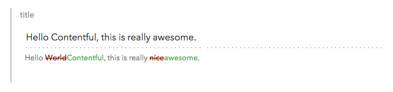

# Diff UI Extensions

The diff editor extension shows the diff between the draft value and the published value of a short text field.



## Installation and usage

Check you have the [requirements](../README.md#requirements) needed to use extensions.

## Local development

Start a local server, changing the port if needed:

```bash
python -m SimpleHTTPServer 3030
```

Don't use the `extension.json` descriptor file but instead use 3rd party hosting from `localhost`

```bash
contentful extension update --force --src 'http://localhost:3030/index.html' --id diff --name diff --field-types Symbol -field-types Text
```

The [same constraints](../README.md#debugging-on-your-local-environment) apply to loading unsafe scripts.

## Using the extension in the Contentful web app

Enable the extension in the Contentful web app for a "Short text" field by opening the _Settings_ for a field and selecting the widget in the _appearance_ tab.
