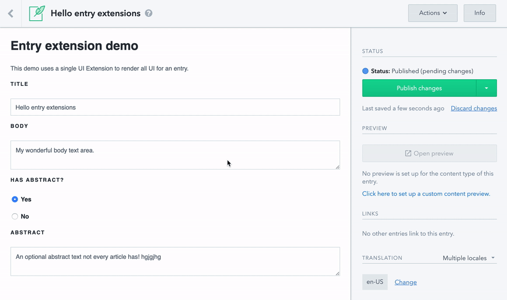
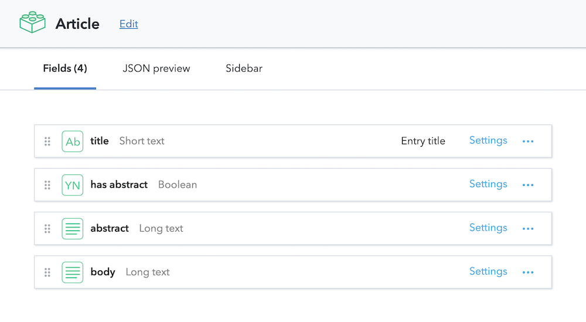

# Entry editor extension

This example shows how an [entry editor extension](/developers/docs/extensibility/ui-extensions/locations/#entry-extensions) is used to customize the editing experience of an entire entry by making some fields conditional.

It uses a boolean value to toggle visible of a field `abstract` so an editor can choose if this field is needed or not.

## Requirements

This example depends on a specific content type:

It needs to be assigned to a content type with the following fields:

- `hasAbstract` of type `boolean`
- `abstract` of type `text`

You can find the used content type in this [json file](./sample-content-type.json).

## Usage

- create the needed content type
- install the dependencies of the example with `npm i`
- push a development version of the example to your space `npm space use && npm run start`
- assign the extension as `entry extension` in the content modelling section of the web app

