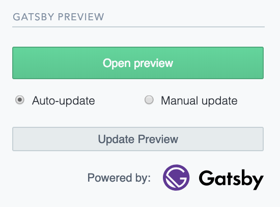

# Gatsby Cloud

Gatsby is an open-source, modern website framework based on React to create and deploy websites or web apps with ease. This UI Extension connects to [Gatsby Cloud](https://www.gatsbyjs.com/cloud/) which lets you see updates to your Gatsby site as soon as you change content in Contentful. This makes it easy for content creators to see changes they make to the website before going live.


## Overview

The extension has the following features:

- monitor changes on content as you type
- real time site updates (de-bounced by 1000 ms)

The extension has the following spec:

- it is a sidebar extension used in a [custom sidebar](https://www.contentful.com/developers/docs/extensibility/custom-sidebar/)
- uses the Contentful design system [Forma 36](https://f36.contentful.com/)
- installation parameter to set global `projectId`
- site parameters to
  - set an optional `slug` fragment for each content type
  - toggle auto-update when typing



## Requirements

In order to use this extension, you need:

- a [Gatbsy Cloud](https://www.gatsbyjs.com/cloud/) setup to use this extension
- a space and the Contentful CLI installed

## Usage

After cloning, install the dependencies

```bash
npm install
```

To bundle the extension

```bash
npm run build
```

To host the extension for development on `http://localhost:1234`

```bash
npm run start
```

To install the extension:

```bash
contentful extension update --force --installation-parameters '{"projectId": "yourGatsbyPreviewId"}'
```
