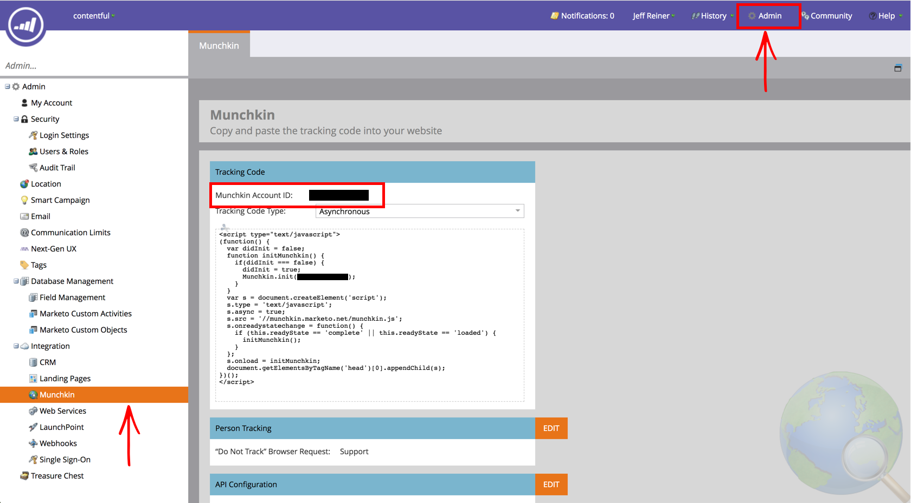
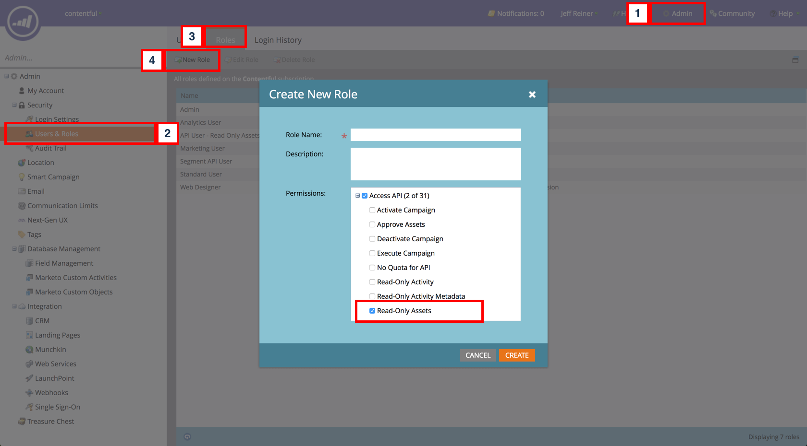
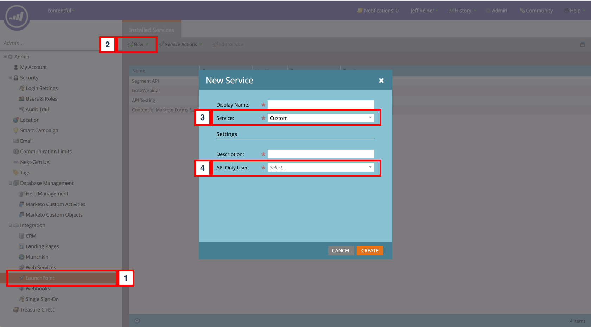
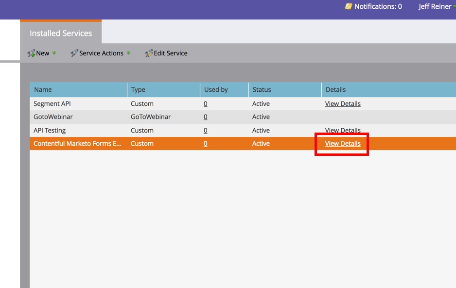

# Marketo forms

This UI extension enables the ability to use the information provided by Marketo's Forms API as a way of programatically building your Contentful-created landing pages forms instead of having to embed the Form's code directly from Marketo on your Landing Pages via an markdown field in Contentful.

## Requirements

- A Marketo instance and access to an admin account
- A Marketo Munchkin Account ID
- A Marketo service with its' Client ID and Client Secret
- Ability to host a lambda function (AWS, Google Cloud Functions, etc...)

## Usage

### 1. Get your credentials from Marketo

To get these values from Marketo, there are two things you must do. These following steps require you to login with the Admin Marketo Account.

We’ll need your Munchkin Account ID, Client Secret, and Client ID.

To get your Munchkin Account ID login to your Marketo account, click Admin in the top right corner, then click Munchkin on the left side bar.



To get your Client Secret and Client ID, you must create a role that has full API access, an API only user, and then create a Service in Marketo. To create a role with full API access:

1.  Click Admin in the top right corner.
2.  Click Users & Roles on the left side bar.
3.  Click on the Roles tab.
4.  Click New Role. Name your role and open the API Access box and select Read Only Assets to assign the user these permissions. Click Create.



Now that you’ve created an API role, you have to assign that role to an API only user.

1.  Click the Users tab.
2.  Click Invite New User and fill out the necessary information in Step 1.
3.  Assign the new role you created to this user in Step 2 and check the API Only box. Click next then Send.

Next, create a Service and get Client Secret and Client ID from that Service.

1.  Click LaunchPoint on the left side bar.
2.  Click New and then New Service from the drop down.
3.  Select Custom for the Service from the drop down.
4.  Select the new API Only user you invited. This User must be an API Only user and be assigned a role that has full API access.



5.  Click View Details on the new service that you’ve created and a small window will display with your Client Secret and Client ID.



### 2. Deploy the Lambda function

Now that you have these credentials you can deploy your Lambda function to your desired platform.

[Here is the code for the lambda function](./lambda-function.js) that you will be deploying.

Copy the values you have from step 1 into the Environment Variables section of your lambda hosting platform. These are the names of the variables you will be adding to that section. **Make sure these are added exactly as below otherwise your lambda function won't work**.

```
MKTO_CLIENT_ID=
MKTO_CLIENT_SECRET=
MKTO_MUNCHKIN_ID=
```
