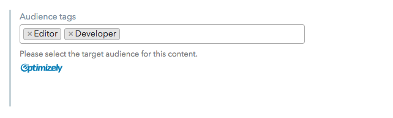

## Optimizely audiences

This UI Extension shows how to make structured content personalisable. The idea is to tag structured content in Contentful with audience ids loaded from a project in Optimizely.

## Requirements

* a project at Optimizely and its ID
* audiences created within that project
* a personal access token with read-only access to the Optimizely projects you'd like to expose to the UI Extension

## Usage

* upload the UI Extension to a space as explained [here](../../#managing-extensions)
* update the content type so it has a `json` field called `audiences`
* assign the `optimizely-audiences` appearance to the `audiences` field
* tag content as needed
* in your consuming applications, load content from Contentful and retrieve the current audience from Optimizely. Render content based on filtering content by the current audience.
