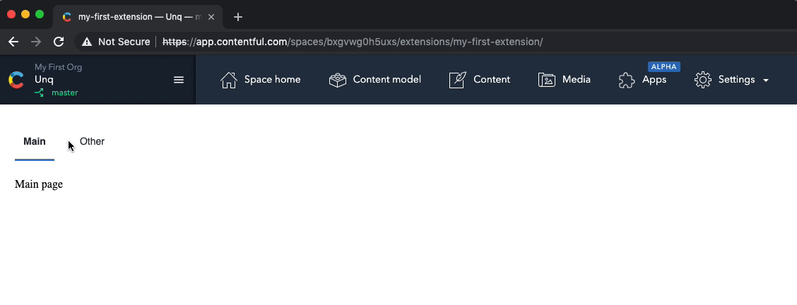

# Page Extension React Router
This UI Extension serves as an example of how to set up a simple React application using React Router for navigation within a page extension.

## Further Information

This example uses React Router, a popular routing solution for SPAs.
Documentation for [React Router](https://reacttraining.com/react-router/web/guides/quick-start).

It also uses the [history](https://github.com/ReactTraining/history) object to be able to listen to 
location changes. This is important for keeping the state of your application intact during a page reload.