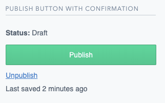
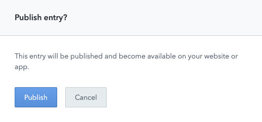
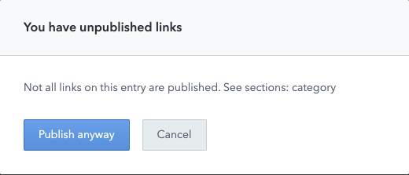

# Publish Confirmation UI Extension

This is a sidebar UI extension which shows the entry status and a publish button. It also has a link to unpublish the entry and shows when the entry was last saved.

When the publish button is clicked, a small popup is shown to confirm the user's desire to publish the entry. It also checks for unpublished child references and provides a warning if any are found.

Here's the normal confirmation where no unpublished references have been found:

And here's the warning when a child reference has been found:

