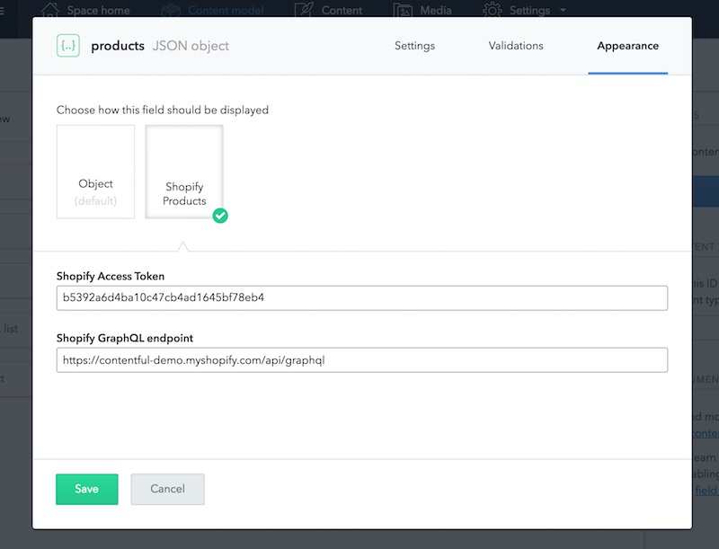

# Contentful Shopify Product UI extension
Add a custom UI field to Contentful that allows users to search and select Shopify products.


## Installation

```sh
git clone git@github.com:contentful/extensions.git
cd extensions/samples/shopify
npm install
```

### Configure

Create a configuration file with your credentials for Contentful.

```sh
cp env.example .env
```

Open `.env` in a editor of your liking and add your Contentful space ID, and management token. [Learn how to obtain a token](https://www.contentful.com/developers/docs/references/authentication/#getting-an-oauth-token).

Load environment variables

```sh
source .env
```

### Create

```sh
npm run create
```

The `create` command will register the extension in your space on Contentful. To use it create a new field of type `JSON object` in the content model of your choice. In the "appearance" tab of this field you can then edit the Shopify settings.

To make the UI extension work you'll need a valid API token and the API endpoint of your Shopify store. By default the UI-extension uses a Contentful shopify store.



### Update

```sh
npm run update
```

Update task will upload the extension to your space on Contentful.

## Ready to Use

