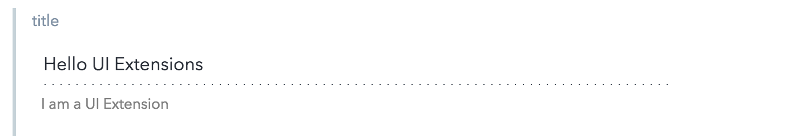
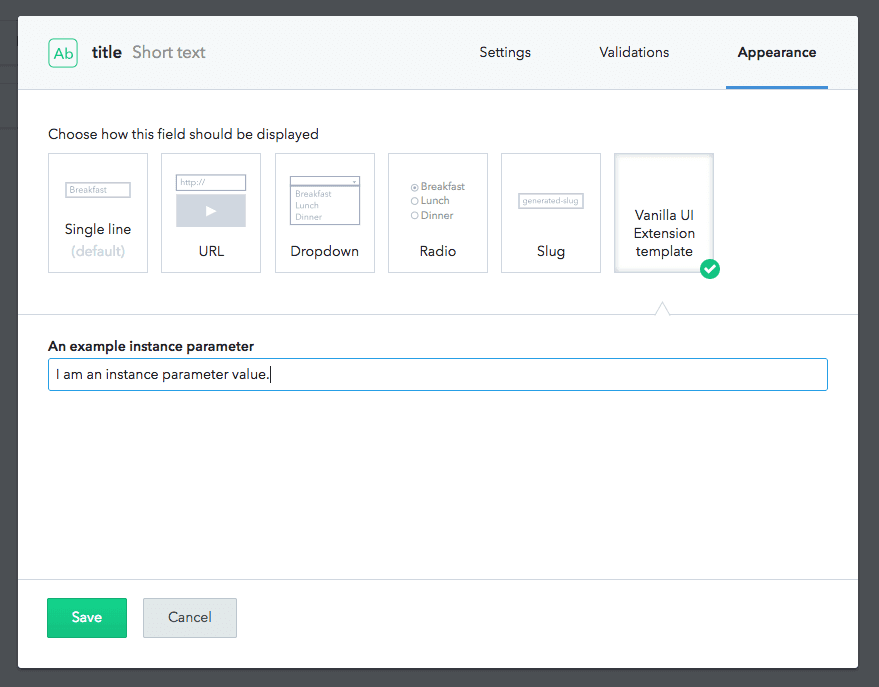

## Vanilla HTML5 UI Extension template

Vanilla HTML5 UI Extension template implementing the basic lifecycle methods to better understand the concept.


The UI Extension in the Contentful web app


Assigning the UI Extension to a content type and setting the instance parameter

The template includes:
- the [UI Extensions SDK][extensions-sdk] library
- a Contentful look-and-feel by loading our CSS library
- basic handling of user-generated events (here: keyboard input)
- basic handling of externally generated events (here: changes introduced by other authors)
- cleanup of event listeners
- example usage of [installation and instance parameters](https://www.contentful.com/developers/docs/references/content-management-api/#/reference/ui-extensions/configuration-parameters)

## Usage

To install the UI Extension:
```bash
contentful extension create --installation-parameters '{"exampleParameter": "I am an installation parameter value."}'
```
To update the UI Extension:
```bash
contentful extension update --force --installation-parameters '{"exampleParameter": "I am an updated installation parameter value."}'
```


[extensions-sdk]: https://github.com/contentful/ui-extensions-sdk/blob/master/docs/ui-extensions-sdk-frontend.md
