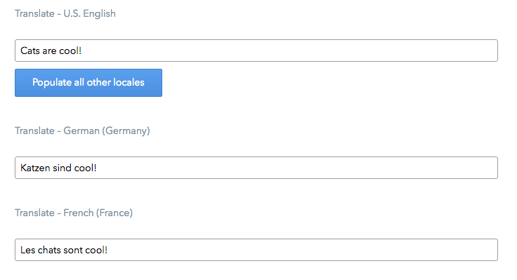

# Translation extension

This extension translates text from the default locale to other locales in a space using the [Yandex](https://translate.yandex.com/) translation API.

## Installation and usage

[Check you have the requirements needed](../README.md#extensions-samples) to use our extensions.
