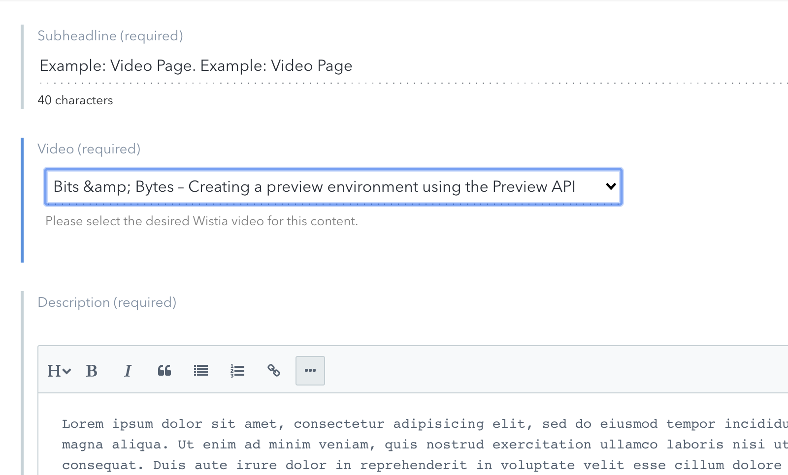
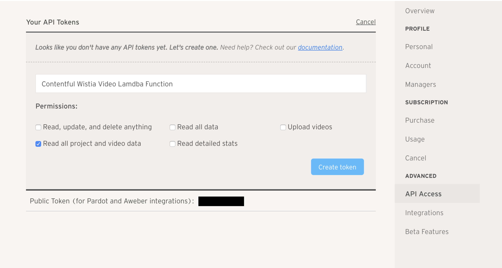
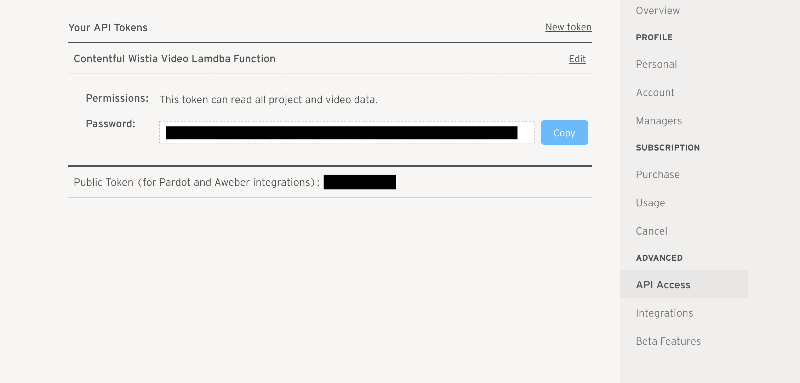

# Wistia videos

This UI extension allows your editors to see a nice dropdown of all the videos in your Wistia account sorted by Projects. Your developers can then use this data to construct landing pages from the data.



## Requirements

- A Wistia account and access to an admin account
- A Wistia API Key with permissions: _read all project and video data._
- Ability to host a lambda function (AWS, Google Cloud Functions, etc...)

## Usage

### 1. Get your Wistia key

Go to your _Account > Settings_ in Wistia. On the sidebar click on **API Access** under the **Advanced** header.

Create an API key with the permissions _Read all project and video data_.



Once you've created your API Token click _Copy_ and save it for the next step.



### 2. Deploy the Lambda function

Now that you have these credentials you can deploy your Lambda function to your desired platform.

[Here is the code for the lambda function](./lambda-function.js) that you will be deploying.

Copy the API_KEY you have from step 1 into the Environment Variables section of your lambda hosting platform. Here is the names of the variable you will be adding to that section. **Make sure the key name is added exactly as below otherwise your lambda function won't work**.

```
WISTIA_API_KEY=
```
